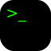

# Cutie Terminal

[](https://dl.circleci.com/status-badge/redirect/gh/cutie-shell/cutie-terminal/tree/droidian)


The terminal app for Cutie UI.

## Building and installing

```
mkdir build
cd build
cmake ..
make
sudo make install
```

## Troubleshooting
None
